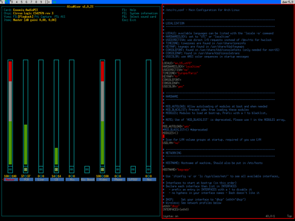

<!-- Add banner here -->


<center>


<br/>

# Suckless Terminal (ST)

</center>

<!-- Add buttons here -->
<center>


</center>
<!-- Describe your project in brief -->

The suckless terminal (st) with some additional features that make it literally the best terminal emulator ever :

<br/>
<center>

</center>

<br/>

Suckless terminal is based suckless philosiphy which means its really light weight and full flegid terminal emulator. But the problems are its too lightweight for a normal it doesn't have some basic functionality like scrolling up and down or to copy some text but with some mods suckless terminal it could becoma one of the best terminal emulator that a mankind had ever see.

Can you also costomize it on top of my patches? Yes ofcourse you can you can not only add your packages on top of my but you can also remove my packages not only extensions but also themes currently I am using gruvbox theme its a best theme for me its calm dusky and great. Let's see which color scheme you might use.

## Pretty stuff

- Compatibility with Xresources and pywal for dynamic colors.
- Default gruvbox colors otherwise.
- Transparency/alpha, which is also adjustable from your Xresources.
- Default font is system "mono" at 14pt, meaning the font will match your system font.

## Installation for newbs

```
    git clone https://github.com/prinixos/st
    cd st
    sudo make install
```

Obviously, `make` is required to build. `fontconfig` is required for the default build, since it asks `fontconfig` for your system monospace font. It might be obvious, but `libX11`and `libXft` are required as well. Chances are, you have all of this installed already.

On OpenBSD, be sure to edit `config.mk` first and remove `-lrt` from the `$LIBS` before compiling.

Be sure to have a composite manager (`xcompmgr`, `picom`, etc.) running if you want transparency.

# Table of contents

After you have introduced your project, it is a good idea to add a **Table of contents** or **TOC** as **cool** people say it. This would make it easier for people to navigate through your README and find exactly what they are looking for.

Here is a sample TOC(_wow! such cool!_) that is actually the TOC for this README.

- [Project Title](#project-title)
- [Demo-Preview](#demo-preview)
- [Table of contents](#table-of-contents)
- [Installation](#installation)
- [Usage](#usage)
- [Development](#development)
- [Contribute](#contribute)
  - [Sponsor](#sponsor)
  - [Adding new features or fixing bugs](#adding-new-features-or-fixing-bugs)
- [License](#license)
- [Footer](#footer)

# Development

[(Back to top)](#table-of-contents)

This is the place where you give instructions to developers on how to modify the code.

You could give **instructions in depth** of **how the code works** and how everything is put together.

You could also give specific instructions to how they can setup their development environment.

Ideally, you should keep the README simple. If you need to add more complex explanations, use a wiki. Check out [this wiki](https://github.com/navendu-pottekkat/nsfw-filter/wiki) for inspiration.
